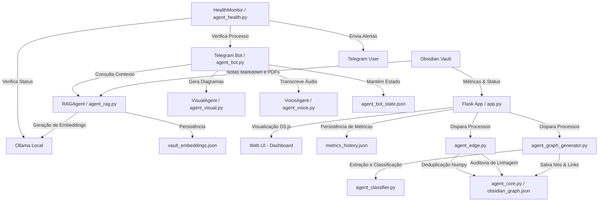

# Obsidian Neural Graph App 🧠🕸️

O **Obsidian Neural Graph App** é um ecossistema inteligente de curadoria de conhecimento e mapeamento de competências profissionais. Ele foi projetado para sincronizar notas do Obsidian, transcrever aulas de MBA, classificar semanticamente artigos e experiências, e gerar um grafo de conhecimento neural interativo em 2D/3D (D3.js).

O sistema opera de forma local e assíncrona, combinando embeddings semânticos (Ollama), inteligência artificial generativa (Groq e Ollama local) e um assistente conversacional no Telegram.

---

## 📐 Diagrama de Arquitetura

O ecossistema é modularizado em agentes autônomos com responsabilidades bem definidas:



---

## 🕵️‍♂️ Divisão de Agentes do Ecossistema

1. **`agent_core.py` (Núcleo)**: Centraliza a leitura/escrita do grafo (`obsidian_graph.json`) com locks de arquivo inter-processo robustos (`fcntl`), inicializa a observabilidade unificada (logs estruturados JSON e captura de exceções globais) e concentra cálculos de similaridade de cosseno.
2. **`agent_graph_generator.py` (Gerador de Grafos)**: Varre o Obsidian Vault do Felipe, dispara a triagem semântica das notas e salva o grafo de forma incremental em memória antes do merge final.
3. **`agent_classifier.py` (Classificador)**: Analisa o tom e estrutura das notas Markdown para classificá-las em três categorias (MBA, Work ou Tool), aplicando heurísticas rápidas e chamadas de fallback ao Ollama.
4. **`agent_edge.py` (Auditor de Linhagem)**: Analisa o grafo em segundo plano em busca de nós sem pais (órfãos), calcula duplicatas utilizando álgebra vetorizada (Numpy) de alta performance e descobre links semânticos cruzados (cross-links) entre tecnologias e projetos de trabalho.
5. **`agent_sanitizer.py` (Higienizador)**: Remove nós duplicados ou fundidos do arquivo físico, desvia arestas afetadas e remove self-loops.
6. **`agent_rag.py` (Mecanismo RAG)**: Permite pesquisas semânticas rápidas nas notas e arquivos PDF com base em embeddings locais.
7. **`agent_bot.py` (Telegram Bot)**: Interface conversacional que atende Felipe, transcreve anotações de voz em tempo real e desenha diagramas técnicos (Napkin AI).
8. **`agent_health.py` (Monitor de Integridade)**: Monitora em tempo real a disponibilidade do servidor Ollama e o processo do bot do Telegram, alertando Felipe caso ocorram falhas.

---

## 🚀 Requisitos e Configuração

### Requisitos Mínimos
- Python 3.9 ou superior.
- Ollama instalado localmente rodando os modelos:
  - `gemma4:latest` (ou modelo de texto de sua escolha).
  - `nomic-embed-text:latest` (ou modelo de embeddings compatível).

### Instalação
1. Clone o repositório no seu ambiente de desenvolvimento.
2. Crie e ative o ambiente virtual Python:
   ```bash
   python3 -m venv .venv
   source .venv/bin/activate
   ```
3. Instale as dependências exigidas:
   ```bash
   pip install -r requirements.txt
   pip install pytest pytest-mock  # Dependências de testes
   ```

### Configuração do Ambiente (`.env`)
Copie o arquivo `.env.example` para `.env` e preencha as variáveis correspondentes:
```bash
cp .env.example .env
```
Variáveis principais a serem definidas:
- `GROQ_API_KEY`: Token de acesso para a API rápida da Groq.
- `TELEGRAM_BOT_TOKEN`: Token do bot criado pelo @BotFather.
- `FLOSE_API_KEY`: API key secreta para proteger os endpoints do Flask.
- `FLOSE_VAULT_PATH`: Caminho físico da sua pasta de notas do Obsidian.

---

## 💻 Execução

### 1. Iniciar Servidor Web Flask
O painel visual e os endpoints de sincronização rodam no Flask. Inicialize via terminal:
```bash
bash run_server.sh
```
Ou manualmente:
```bash
python3 app.py
```
Acesse o painel localmente em `http://localhost:8091`.

### 2. Iniciar o Bot Conversacional do Telegram
Para colocar o bot do Telegram para rodar em segundo plano:
```bash
python3 agent_bot.py
```

### 3. Rodar Pipeline de Sincronização Manualmente
Você pode disparar o ciclo completo de sincronização de notas do Vault do MBA e geração de grafos executando:
```bash
bash run_update.sh
```

---

## 🧪 Rodando Testes Unitários e Integração

O ecossistema é coberto por testes robustos e simulados (100% off-line). Execute a suite usando:
```bash
pytest tests/
```

Para verificar logs estruturados ou habilitar testes em modo debug:
```bash
LOG_LEVEL=DEBUG pytest tests/
```
