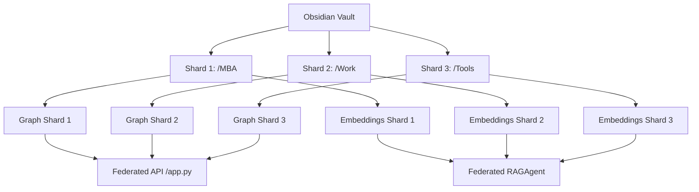

# Especificação Conceitual: Sharding Horizontal para Vaults Massivos

Este documento descreve o design arquitetural planejado para habilitar **Sharding (Particionamento)** no ecossistema `obsidian_graph_app`. Quando o Vault do Obsidian ultrapassa dezenas de milhares de notas, o processamento linear em um único arquivo de grafo (`obsidian_graph.json`) e um único banco de embeddings (`vault_embeddings.json`) torna-se inviável devido a:
1. Gargalos de E/S de disco (reescrever arquivos de 100MB+ a cada ciclo).
2. Limites de memória e latência no cálculo de similaridade de cosseno (busca RAG).
3. Complexidade de renderização no D3.js no frontend (travamento do DOM com 10.000+ nós).

---

## 1. Visão Geral do Sharding

O sharding divide o vault do Obsidian e as bases de dados dos agentes em múltiplos fragmentos (**shards**) baseados na estrutura de diretórios do Vault.

---

## 2. Estratégia de Particionamento

### 2.1. Identificação do Shard (Mapeamento de Diretórios)
O Vault é particionado horizontalmente com base no subdiretório de nível 1.
- Caminhos sob `vault/MBA/` pertencem ao Shard `mba`.
- Caminhos sob `vault/Trabalho/` pertencem ao Shard `work`.
- Caminhos sob `vault/Tecnologia/` pertencem ao Shard `tool`.
- Notas soltas na raiz pertencem ao Shard `default`.

### 2.2. Separação de Arquivos de Dados
Para cada Shard $S$, os agentes de linhagem e RAG gerenciam arquivos isolados:
1. **Grafo Shard**: `obsidian_graph_shard_[S].json`
2. **Embeddings Shard**: `vault_embeddings_shard_[S].json`
3. **Queue Shard (SQLite)**: `logs/task_queue_shard_[S].db`

---

## 3. Arquitetura dos Agentes Shardados

### 3.1. RAGAgent Federado
A busca semântica em RAG realiza uma consulta distribuída (MapReduce) nos caches individuais:
- **Fase Map**: O RAGAgent lê em threads paralelas o cache de embeddings de cada shard e calcula a similaridade do cosseno.
- **Fase Reduce**: Os scores top-K de cada shard são agregados, ordenados de forma global e filtrados pelo threshold de corte.

### 3.2. Curador de Linhagem (Edge Agent)
- Cada Shard roda sua própria thread ou processo isolado do `agent_edge.py` restrito aos nós do seu Shard.
- **Pontes Inter-Shard (Cross-Links)**: Conexões entre nós de shards diferentes são registradas em uma tabela de pontes centralizada (`obsidian_graph_bridges.json`), evitando mutar os arquivos de shard individuais.

---

## 4. Federação no Servidor Flask (API)

A API do `app.py` expõe endpoints que agregam dados sob demanda:
- **/api/graph**: O Flask lê cada arquivo de shard, unifica os nós e edges na memória e adiciona as pontes inter-shard de forma sob demanda.
- **/api/health**: Monitora a integridade de processamento de cada shard individualmente.

---

## 5. Vantagens e Escalabilidade

1. **Paralelismo**: Agentes RAG podem indexar o Shard 1 sem travar ou concorrer com o Shard 2.
2. **I/O Otimizado**: O tamanho de escrita de cada arquivo JSON reduz de forma drástica.
3. **Renderização Lazy**: O frontend pode carregar apenas o Grafo do Shard ativo (ex: visualizar apenas disciplinas do MBA) e puxar outros shards sob demanda ao expandir conexões.
