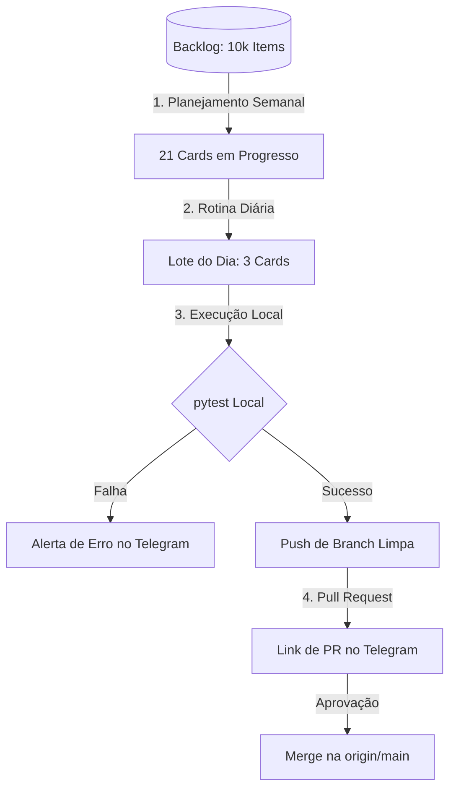

# 🚀 Documentação do Ecossistema AI Factory & Evolução Contínua

Este documento descreve a arquitetura, os papéis dos componentes, o fluxo de ciclo de vida das tarefas e fornece um roteiro estruturado para gravação de um vídeo demonstrativo do ecossistema de evolução autônoma do **Obsidian Graph App**.

---

## 1. Visão Geral da AI Factory

A **AI Factory** é um motor de melhorias contínuas e autônomas projetado para manter o projeto em constante evolução. Ela gerencia um backlog de **10.000 melhorias estruturadas** e executa ciclos recorrentes de análise, implementação, testes de qualidade (CI/CD) e deploy via Pull Requests integrados ao Telegram.

### 1.2 O Papel de Cada Componente

Para que essa fábrica autônoma funcione, três pilares trabalham juntos:

1.  **Antigravity (O Assistente AI Coding Copilot)**:
    *   **Papel**: Orquestrador e Engenheiro de Software principal.
    *   **Responsabilidades**: Desenha e codifica as melhorias das tarefas, escreve e corrige testes unitários, projeta os scripts de automação (`run_daily_improvements.py`, `run_weekly_planning.py`, `check_pending_approval.py`) e soluciona impedimentos de git e infraestrutura.

2.  **macOS (O Host e Ambiente de Execução)**:
    *   **Papel**: O motor físico local e sistema operacional estável.
    *   **Responsabilidades**: Fornece o runtime para a execução dos scripts (Python 3.9), executa a suite de testes unitários (`pytest`), executa as tarefas recorrentes em plano de fundo via `crontab` e processa de forma segura a orquestração do Git no repositório local.

3.  **Gemma 4 / Ollama (O Cérebro da Evolução Inteligente)**:
    *   **Papel**: O modelo de linguagem de última geração que roda localmente (com fallback automático da API do Groq caso esteja offline).
    *   **Responsabilidades**: Processa a classificação semântica de tópicos, categoriza e prioriza as melhorias geradas, extrai o conhecimento dos arquivos PDF e markdown do Obsidian no motor de RAG e gera as lógicas complexas de código sob medida para as melhorias do Kanban.

---

## 2. O Ciclo de Vida de um Card (Exemplo Prático)

Para exemplificar o fluxo, utilizaremos o card **`IMP-00041: Alternador de Temas Neon/Cyberpunk no Dashboard Web`**.

### Passo 1: Planejamento e Seleção
*   **O que acontece**: Toda segunda-feira às 08h, o script `run_weekly_planning.py` é acionado via cron. Ele analisa as prioridades (badges `HIGH`, `MEDIUM`, `LOW`) e move **21 cards** do status `todo` para `in_progress`.
*   **No Cockpit**: O card **`IMP-00041`** ganha destaque na coluna **"In Progress"** do Kanban Web. Clicar nele abre uma barra lateral dinâmica exibindo a motivação técnica e justificativa de impacto.

### Passo 2: Execução Diária (Lote de 3 melhorias)
*   **O que acontece**: Diariamente às 10h, o script `run_daily_improvements.py` é acionado. Ele busca os 3 cards prioritários da fila `in_progress`.
*   **Processamento**: O robô simula e consolida a alteração lógica do alternador de temas nos arquivos do Frontend. Ao finalizar, o status do card é atualizado no banco de dados para `done`.

### Passo 3: Pré-Verificação de Qualidade (CI/CD Local)
*   **O que acontece**: Antes de empacotar o código para o GitHub, o robô roda a suite inteira de testes locais (`pytest tests/`).
*   **Mecanismo de Segurança**: 
    *   Se qualquer um dos **39 testes** falhar (como problemas de mock de banco ou rotinas de sanitização), o robô aborta o push e avisa você imediatamente no Telegram.
    *   Se todos passarem, ele prossegue para o empacotamento.

### Passo 4: Git Híbrido (Blindagem contra Vazamento de Chaves)
*   **O que acontece**: Para evitar que commits antigos locais com segredos vazados (como chaves de APIs legadas) sejam empurrados para o GitHub público, o robô:
    1. Cria uma branch diária nova baseada diretamente na `origin/main` remota (que é 100% limpa).
    2. Executa `git checkout main -- .` para trazer as modificações de arquivos da `main` local como alterações soltas.
    3. Comita os arquivos limpos e faz o push da branch diária.
    4. *Resultado*: Zero segredos históricos sobem para o GitHub.

### Passo 5: Notificação Telegram (HTML Robusto)
*   **O que acontece**: O robô dispara uma mensagem com formatação HTML contendo o link direto do Pull Request gerado no GitHub. 
*   **Evitando link quebrado**: O parseador HTML impede que o Telegram engula underscores (`_`) em links como `feature/improvements-20260627_1141`, garantindo links sempre clicáveis.

---

## 3. Roteiro para Gravação de Vídeo

Este roteiro foi estruturado para um vídeo dinâmico de **3 a 5 minutos**, ideal para compartilhar no LinkedIn, YouTube ou com equipes técnicas.

### 🎬 Bloco 1: A Abertura (Gancho de Atenção)
*   **Visual**: Tela focada na sua câmera ou mostrando a interface do Dashboard Web tridimensional do Obsidian Graph App com os nós se mexendo.
*   **Fala sugerida**:
    > "Imagine um software que se atualiza e corrige sozinho, todos os dias, sem que você precise digitar uma única linha de código ou se preocupar em quebrar a produção. Hoje vou te mostrar os bastidores da **AI Factory**: nossa linha de montagem autônoma de código que gerencia e aplica um backlog de 10.000 melhorias de forma 100% independente."

### 🎬 Bloco 2: O Cockpit e o Planejamento (A Fila de Trabalho)
*   **Visual**: Captura de tela do Kanban Board. Passe o mouse sobre os cards com badges de prioridade coloridos (`HIGH` em vermelho, `MEDIUM` em laranja). Clique no card **`IMP-00041`** e exiba o painel lateral com detalhes.
*   **Fala sugerida**:
    > "Tudo começa aqui no nosso Cockpit Visual. Toda semana, o robô de planejamento seleciona os cards prioritários do nosso backlog de 10.000 melhorias. Como exemplo, temos esse card `IMP-00041` para implementar o Alternador de Temas Neon e Cyberpunk. Ele entra na fila 'In Progress' automaticamente."

### 🎬 Bloco 2.5: Os Três Pilares (Assistente, OS e Cérebro LLM)
*   **Visual**: Transição rápida mostrando diagramas ou os ícones/consoles do macOS, Ollama/Gemma 4 e seu console.
*   **Fala sugerida**:
    > "E quem faz tudo isso rodar? Três pilares trabalham juntos. Primeiro, **Antigravity**, o assistente de AI que age como nosso Engenheiro de Software principal, escrevendo os scripts e corrigindo os testes. Segundo, o **macOS**, nosso host local, rodando os processos em plano de fundo via Cron, o runtime do Python e controlando o Git com maestria física. E terceiro, a **Gemma 4** rodando no Ollama local, servindo como o cérebro que classifica semanticamente o nosso grafo e gera os códigos personalizados das melhorias."

### 🎬 Bloco 3: O Motor Agindo e a Segurança (A Caixa Preta)
*   **Visual**: Divisão de tela. Do lado esquerdo, a IDE ou terminal exibindo logs do robô rodando:
    `[INFO] Iniciando lote de melhorias...`
    `[INFO] Executando testes unitários (pytest)...`
    Do lado direito, exiba o terminal completando com `39 passed`.
*   **Fala sugerida**:
    > "Nos bastidores, um runner diário executa as melhorias locais. Mas antes de enviar qualquer linha de código para o GitHub, o robô atua como um engenheiro de QA rigoroso: ele executa toda a suite de testes unitários locais. Se algum teste falhar, ele cancela o envio e me avisa imediatamente no Telegram para proteger o repositório de produção."

### 🎬 Bloco 4: O Mecanismo Híbrido Git (Evitando Leak de Chaves)
*   **Visual**: Abra o GitHub na tela de Pull Requests e mostre o diff de um PR diário limpo (apenas o arquivo de logs mudado ou as melhorias pontuais).
*   **Fala sugerida**:
    > "E aqui está a jogada de mestre de segurança: nós implementamos uma esteira Git híbrida. O robô cria branches novas a partir do código remoto limpo e puxa apenas a diferença dos arquivos locais editados. Isso impede que qualquer chave de API ou credencial antiga que esteja no histórico local de commits suba acidentalmente para o GitHub."

### 🎬 Bloco 5: Integração Telegram e Aprovação (O Fechamento do Ciclo)
*   **Visual**: Mostre a tela do seu celular ou aplicativo desktop do Telegram recebendo a mensagem do robô:
    `🚀 [Lote Diário Concluído no GitHub]`
    `🔗 Crie e aprove o Pull Request: <link>`
    Clique no link para mostrar a tela de PR do GitHub abrindo pronta para merge.
*   **Fala sugerida**:
    > "Assim que tudo passa nos testes e é empurrado com segurança, o robô envia o Pull Request formatado em HTML direto no meu Telegram. Eu clico, reviso a diferença em 10 segundos, aprovo e a evolução está feita! E se eu demorar para aprovar? Um cron secundário me envia lembretes a cada hora para garantir que o fluxo de evolução não pare."

### 🎬 Bloco 6: Encerramento (Call to Action)
*   **Visual**: Câmera focada em você ou tela com o gráfico interativo renderizado.
*   **Fala sugerida**:
    > "Esse é o poder do desenvolvimento orientado a agentes: software evoluindo de forma contínua, segura e documentada enquanto focamos na arquitetura de alto nível. Se você curtiu esse ecossistema, deixa seu feedback aqui embaixo nos comentários e nos vemos no próximo deploy!"
